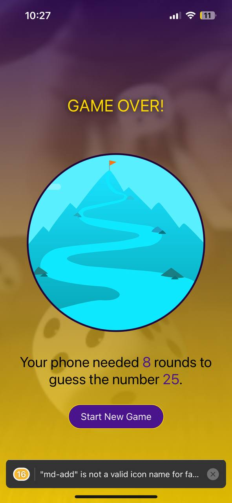

# **Ocean Number Game**

A React Native mobile game where players compete against the computer in a number-guessing challenge. Built with Expo, featuring a sleek, modern UI design and engaging gameplay.

---

## **Features**

- 🎮 **Interactive Gameplay:** Enjoy a fun and challenging number-guessing experience.
- ✨ **Elegant UI:** Designed with custom animations and smooth transitions.
- 📱 **Responsive Design:** Works seamlessly on both iOS and Android devices.
- 🎨 **Dynamic Themes:** Includes vibrant color themes for a visually appealing experience.
- 📊 **Score Tracking:** Tracks player and computer scores in real-time.
- 🛠 **Custom Components:** Reusable and optimized styled components.

---

## **Screenshots**

### Game Screen


### Victory Screen


---

## **Technologies Used**

- **React Native:** For building cross-platform mobile applications.
- **Expo:** To simplify development and deployment.
- **Styled Components:** For elegant, modular styling.
- **Linear Gradients:** To enhance UI aesthetics.
- **Custom Fonts:** For a unique and polished design.

---

## **Installation**

1. **Clone the repository:**

   ```bash
   git clone https://github.com/byimer1/ocean-number-game.git
   cd ocean-number-game
Install dependencies:

2. **Install dependencies:**

   ```bash
   npm install
   ```

3. **Start the development server:**

   ```bash
   npx expo start
   ```

---

## **How to Play**

1. You choose a secret number.
2. The computer guesses a number, and you provide hints like "higher" or "lower."
3. The computer continues guessing until it correctly identifies your number.
4. Track the game progress and game ends once it figures it.

---

## **Acknowledgments**

This project was **inspired by a tutorial video** and modified to include a unique UI design, enhanced gameplay features, and additional customizations to suit my personal style and vision.
